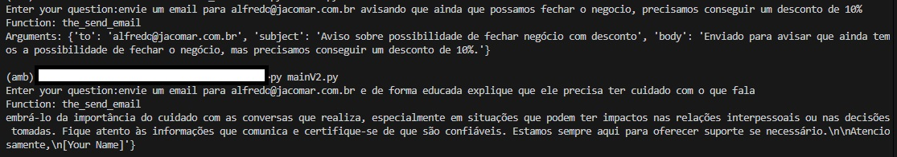

# call_functions

Testando o uso de chamada de funções pelo LM Studio e script.

- Instale o LM Studio.
- Baixe o modelo Qwen2.5-3B-Instruct-GGUF/Qwen2.5-3B-Instruct-Q4_K_M.gguf
- Inicie o servidor no LM Studio.
- Crie um virtualenv no python.
- Instale as dependências do python.
- Execute qualquer um dos scripts abaixo terminados em .py

Estou aprendendo como usar as funções, mas sem dúvida é uma ferramenta poderosa! acredito que com ela o LLM faça mais sentido, pois transforma um texto em argumentos de funções, além de avaliar qual função é a mais adequada para o texto.

